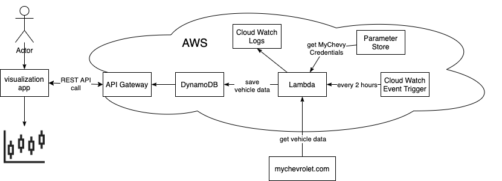
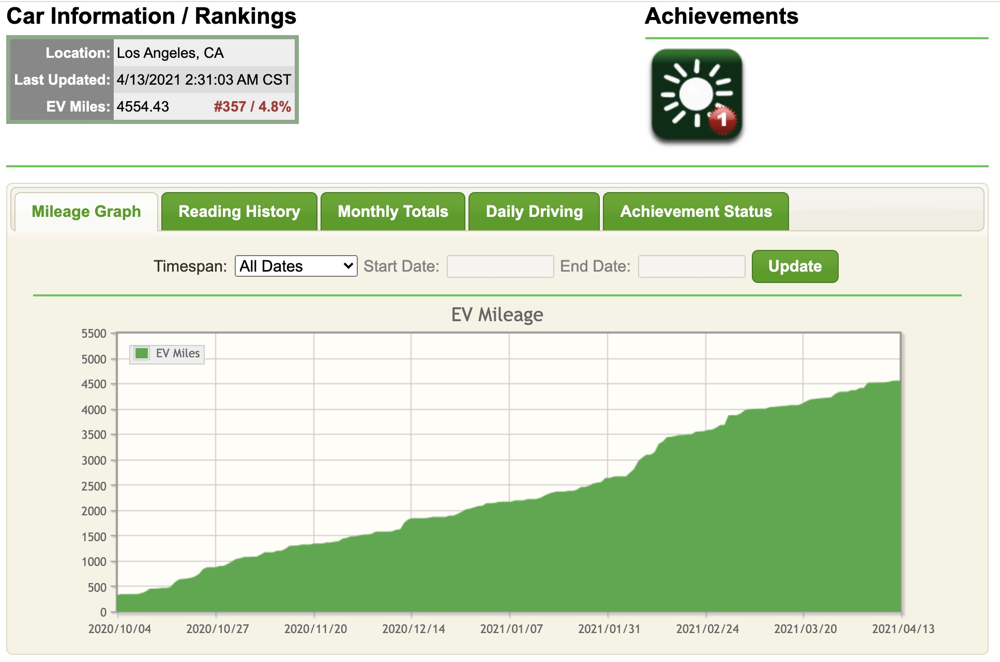
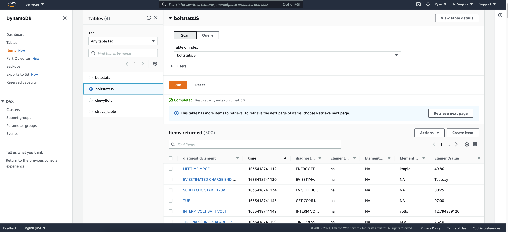

 # Bolt Stats

### What is Bolt Stats?

Bolt Stats is my library of code to reimplement some of the features of voltstats.net.

In short it will consist of two parts:
 1. an AWS service that automatically calls OnStar and saves diagnostic data to the cloud.
 2. an interface to pull and visualize the data(website, flask app, or python library)




### what is voltstats.net?
voltstats.net was a website that tracked vehicle diagnostic data using General Motor's OnStar service. Example data points include odometer readings, battery level, and charge status. Sadly, as of April 24th, 2021, the website stopped collecting new data

https://www.voltstats.net/boltev/stats/details/13187


 
## Part 1 (Data Collection)

The first of the two parts is to continuously collect the diagnostic data on a set interval.

1. create a `Lambda` function using the the function.zip file
2. add a parameter to `Parameter Store` with the name `mychevrolet`:
```
{"username": "myemail@example.com",
"password": "mypassword",
"onStarPin": "1234",
"deviceId": "12345678-1234-1234-1234-123456789abc",
"vin": "12345678901234567"}
```
*use https://www.uuidgenerator.net/version4 to generate an actual new random v4 UUID for the deviceId*

3. create a `CloudWatch Events` trigger with schedule expression: `cron(0/20 * * * ? *)`

4. create a `DynamoDB` table called boltstatsJS using 
   - Partition key: 'diagnosticElement' (String)
   - Sort key: 'time' (Number)





## Part 2 (Data Visualization)